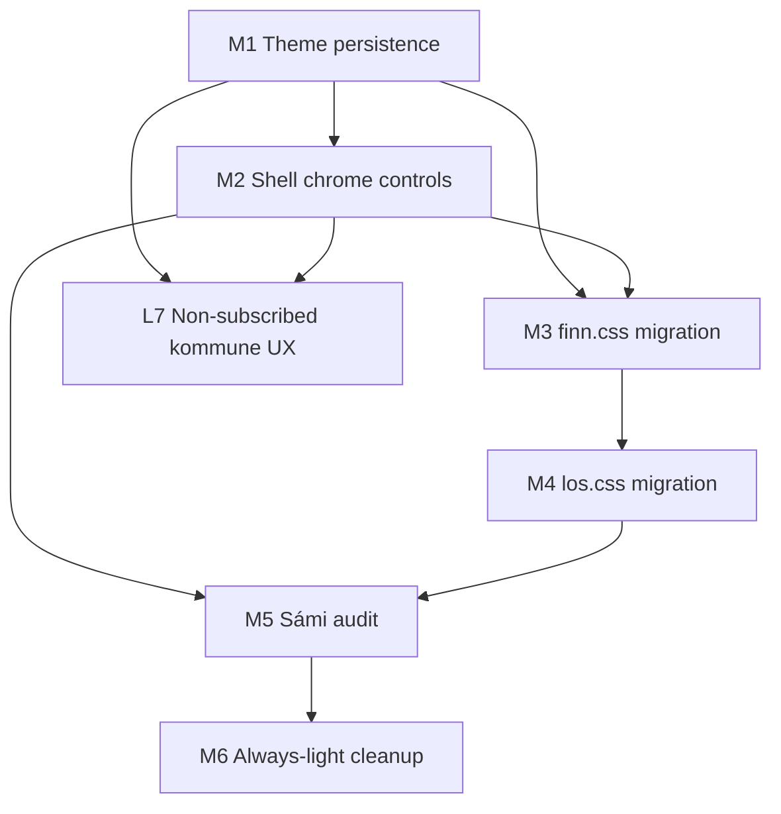

# Hjerterum PRD — Atlas orchestration plan

**Version:** 1.0 · July 2026  
**Purpose:** Coordinate parallel Cloud Agent work to complete PRD §15.8 (Finn/Los Boly Standard) and §6.2 / L-7 (non-subscribed kommune onboarding).  
**Canonical PRD:** `docs/hjerterum/PRD.md`  
**Agent briefs:** `docs/hjerterum/agents/M*.md`, `L7-*.md`

---

## Scope

| Track | PRD refs | Gate |
|-------|----------|------|
| **UI migration M1–M6** | §15.8, UX-7/8/15/16/17 | Tourism GA blocker |
| **L-7 onboarding** | §6.2, L-7 | Pilot kommune expansion |

Refactor waves W1–W7 are **complete** (`REFACTOR_PLAN.md`). Atlas picks up **product** gaps.

---

## Dependency graph

**Parallel lanes after M1:**
- Agent A: M2 + M3 (Finn)
- Agent B: M4 (Los)
- Agent C: L7 (backend RPC + register/manage)

**Sequential:** M5 (Sámi) after M2–M4 strings stabilize; M6 grep cleanup last.

---

## Wave index

| Brief | Status | Branch suffix | Depends |
|-------|--------|---------------|---------|
| [M1-theme-persistence.md](./agents/M1-theme-persistence.md) | In progress | `prd-m1-theme` | — |
| [M2-shell-chrome.md](./agents/M2-shell-chrome.md) | In progress | `prd-m2-shell` | M1 |
| [M3-finn-css.md](./agents/M3-finn-css.md) | In progress | `prd-m3-finn` | M1, M2 |
| [M4-los-css.md](./agents/M4-los-css.md) | In progress | `prd-m4-los` | M1 |
| [M5-sami-audit.md](./agents/M5-sami-audit.md) | Ready | `prd-m5-sami` | M2–M4 |
| [M6-light-cleanup.md](./agents/M6-light-cleanup.md) | Ready | `prd-m6-cleanup` | M3–M5 |
| [L7-kommune-onboarding.md](./agents/L7-kommune-onboarding.md) | In progress | `prd-l7-kommune` | M1 |

---

## Definition of done (Atlas complete)

- [x] `profiles.preferred_theme` migration deployed
- [x] Guest + logged-in theme toggle on app, Finn, Los
- [x] Language selector on Finn + Los shells (no / `se` / en)
- [x] `finn.css` / `los.css` use `[data-theme]` tokens — no forced light shell
- [x] L-7: landlords in non-subscribed kommuner skip social sign-terms; banner copy
- [x] M5 Sámi audit script passes for `finn.ts` + Los keys (key parity)
- [ ] `npm run build` + smoke (`e2e/smoke.spec.ts`) green
- [x] PRD §15.5 status rows updated for shipped UX items

---

## Smoke checklist

- [ ] `/finn` — dark default, theme toggle, language selector
- [ ] `/los` — dark default, theme toggle, language selector
- [ ] Guest theme persists reload (`boly-theme-guest`)
- [ ] Logged-in theme persists reload + profile sync
- [ ] Register in non-subscribed city — no forced sign-terms; banner visible
- [ ] `/homeowner/manage` — tourism/events still work

---

*Atlas supersedes stale "Ready" W2 briefs in `agents/README.md` — those waves are already merged.*
