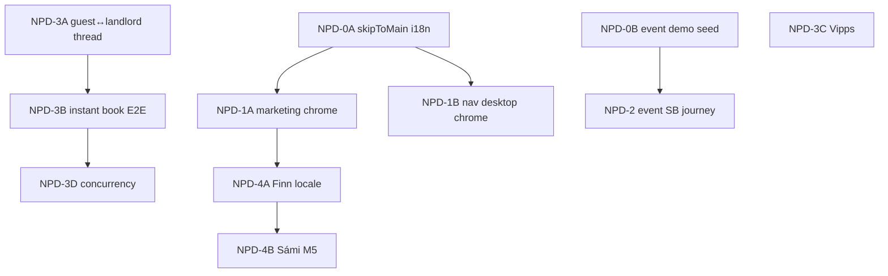

# Hjerterum — NPD-plan (Neste Pilot-Deliverables)

**Versjon:** 1.0 · Juli 2026  
**Formål:** Prioritert leveranseplan etter to automatiserte audit-kjøringer mot `hjerterom-phi.vercel.app` (1. juli 2026).  
**Kilder:**

| Audit | Resultatfil | Score |
|-------|-------------|-------|
| UX/UI (`/ux-ui-audit`) | `docs/hjerterum/UX_UI_AUDIT_RESULTS.txt` | 24 PASS · 2 WARN · **1 FAIL** |
| Product growth (`/product-growth-audit`) | `docs/hjerterum/audits/PRODUCT_GROWTH_AUDIT_RESULTS.txt` | 36 PASS · 6 WARN · **1 FAIL** |

**Relatert:** `PRD.md` §15, `UI_UX_GOVERNANCE.md` §6, `PRODUKTANALYSE_AKTORER.md`, `DEMO_NARVIK_OFOTEN.md`, `ATLAS.md` (M1–L7, fullført)

**Status phi:** Pilot-klar med **to felles blockers** og seks UX-advarsler. Atlas-sporet (Finn/Los Boly-standard, L-7) er i stor grad levert på `main`; NPD tar over der auditene avdekker hull.

---

## 1. Executive summary

Phi-deploymenten støtter salgsdemo for Ofoten/Narvik: alle offentlige modul-innganger returnerer 200, ops/kommune/utleier/leietaker-reiser fungerer, og Finn/Los har mørk default med språkvelger i shell.

**Felles blockers (må lukkes før pilot-sign-off):**

1. **`skipToMain` mangler i18n** — SkipLink viser rå nøkkel på alle sider (WCAG + PRD §15.10).
2. **`kari.event@demo.ofoten.no` kan ikke logge inn** — event_ansatt-reisen er utestet; sannsynlig seed/`central_event_staff`-gap på phi Supabase.

**Høyeste vekstfriksjon (ikke deploy-blocker, men NPD-spor):**

- Marketing-landing (`/`) og `/login` mangler theme + språkvelger (PRD §15.3 paritet).
- Boly App (`/nav/*`) — theme toggle og `se`-velger ikke synlig på desktop 1280px.
- Dokumenterte P0-produktgap: leietaker↔utleier-melding per booking, instant book E2E, dedikert event-SB-flate, Vipps, Sámi-nøkkelkompletthet, dobbelbooking-test.

---

## 2. Konsolidert funnmatrise

| ID | Kilde | Alvorlighet | Område | Beskrivelse |
|----|-------|-------------|--------|-------------|
| NPD-B1 | UX | **FAIL** | i18n / a11y | `skipToMain` mangler `no`/`se`/`en` i `lib/i18n` |
| NPD-B2 | Growth | **FAIL** | Demo / auth | `kari.event@demo.ofoten.no` — login feiler på phi |
| NPD-W1 | Growth | WARN | Marketing | `/` — ingen theme toggle eller språkvelger |
| NPD-W2 | Growth | WARN | Auth | `/login` — språkvelger ikke i initial HTML |
| NPD-W3 | UX | WARN | Nav | Theme toggle ikke funnet i header ved 1280px |
| NPD-W4 | UX | WARN | Nav | Locale selector med `se` ikke funnet på `/nav/database` desktop |
| NPD-W5 | Growth | WARN | Hydration | Theme toggle «false negative» før client load på `/finn`, `/los`, `/login` |
| NPD-W6 | Growth | WARN | i18n | Finn underside viser engelsk mens nav er norsk |
| NPD-I1 | Growth | INFO | Produkt P0 | Meldingstråd leietaker↔utleier per booking |
| NPD-I2 | Growth | INFO | Produkt P0 | `tourism_instant_book` — manuell E2E |
| NPD-I3 | Growth | INFO | Produkt | Dedikert `event_ansatt`-UI (delvis `/nav/event/*`) |
| NPD-I4 | Growth | INFO | Betaling | Stripe + Vipps parallelt |
| NPD-I5 | Growth | INFO | i18n | M5 Sámi-nøkkelaudit på alle nye strenger |
| NPD-I6 | Growth | INFO | Booking | First-book-wins / dobbelbooking concurrency-test |

---

## 3. Leveransespor (NPD)

### Spor 0 — Audit-blockers (P0, parallell)

| Brief | Scope | Eier | Avhengighet |
|-------|-------|------|-------------|
| [NPD-0A-skip-link-i18n.md](./agents/NPD-0A-skip-link-i18n.md) | Legg til `skipToMain` i `common.ts` (`no`/`se`/`en`); verifiser SkipLink på `/`, `/finn`, `/nav/database` | 1 agent | — |
| [NPD-0B-event-demo-seed.md](./agents/NPD-0B-event-demo-seed.md) | Re-kjør `seed_narvik_ofoten_demo.sql` på phi; verifiser `event_ansatt` + `central_event_staff` for Kari; oppdater `DEMO_NARVIK_OFOTEN.md` hvis passord/rolle avviker | Ops + 1 agent | — |

**Gate:** Begge `/ux-ui-audit` og `/product-growth-audit` har 0 FAIL på auth + skip link.

---

### Spor 1 — Universal Boly chrome (P1)

| Brief | Scope | PRD | Avhengighet |
|-------|-------|-----|-------------|
| [NPD-1A-marketing-chrome.md](./agents/NPD-1A-marketing-chrome.md) | `ShellChromeControls` (eller tilsvarende) på `/` og `/login` — mørk default, `no`/`se`/`en`, theme toggle | §15.3 | NPD-0A |
| [NPD-1B-nav-desktop-chrome.md](./agents/NPD-1B-nav-desktop-chrome.md) | Synlig theme toggle + språkvelger i Boly App header ved ≥1280px (ikke bare mobilmeny/bunnnav) | §15.3, §15.9 | NPD-0A |

**Gate:** Manuell sjekk 320px + 1280px på `/`, `/login`, `/nav/database` i begge temaer.

---

### Spor 2 — Event saksbehandler-reise (P1)

| Brief | Scope | Avhengighet |
|-------|-------|-------------|
| [NPD-2-event-sb-journey.md](./agents/NPD-2-event-sb-journey.md) | Etter NPD-0B: login → `/nav/event-inquiries` eller dedikert `/nav/event/*`; smoke i product-growth-audit persona `event_sb` | NPD-0B |

**Gate:** `kari.event@demo.ofoten.no` PASS i begge audit-scripts.

---

### Spor 3 — Vekst-P0 produkt (P1–P2, sekvensielt der notert)

| Brief | Scope | Kilde | Prioritet |
|-------|-------|-------|-----------|
| [NPD-3A-guest-landlord-thread.md](./agents/NPD-3A-guest-landlord-thread.md) | Meldingstråd per turisme-booking (Airbnb-konvensjon) | PRODUKTANALYSE §1.1 | P1 |
| [NPD-3B-instant-book-e2e.md](./agents/NPD-3B-instant-book-e2e.md) | `tourism_instant_book` happy path på phi (emma → ingrid) | Growth audit anbefaling #3 | P1 |
| [NPD-3C-vipps-checkout.md](./agents/NPD-3C-vipps-checkout.md) | Vipps ePayment parallelt med Stripe på Finn checkout | UTVIKLINGSPLAN §1.14 | P2 |
| [NPD-3D-booking-concurrency.md](./agents/NPD-3D-booking-concurrency.md) | First-book-wins under samtidig forespørsel | PRD booking | P2 |

---

### Spor 4 — i18n & kvalitet (P1 release-gate for modul-GA)

| Brief | Scope | Gate |
|-------|-------|------|
| [NPD-4A-finn-locale-consistency.md](./agents/NPD-4A-finn-locale-consistency.md) | Undersider følger valgt locale (ikke blandet EN body + NO nav) | WARN NPD-W6 |
| [NPD-4B-sami-audit-m5.md](./agents/NPD-4B-sami-audit-m5.md) | Kjør `npm run i18n-audit` / M5 — 100% `se` på modulstrenger | PRD §15.8 M5, **release blocker** |

---

## 4. Avhengighetsgraf

**Parallellstart etter Spor 0:**

- Agent A: NPD-1A + NPD-1B (chrome)
- Agent B: NPD-2 (event SB)
- Agent C: NPD-4A (Finn locale)

**Sekvensielt produkt:** NPD-3A → NPD-3B → NPD-3D; NPD-3C kan kjøre parallelt med Vipps-credentials.

---

## 5. Wave-indeks

| Brief | Status | Branch suffix | Estimat kompleksitet |
|-------|--------|---------------|----------------------|
| NPD-0A | **Klar** | `npd-0a-skip-i18n` | Liten (1 fil + smoke) |
| NPD-0B | **Klar** | `npd-0b-event-seed` | Liten (SQL + verifikasjon) |
| NPD-1A | Klar | `npd-1a-marketing` | Medium |
| NPD-1B | Klar | `npd-1b-nav-chrome` | Medium |
| NPD-2 | Blokkert av 0B | `npd-2-event-sb` | Liten |
| NPD-3A | Klar | `npd-3a-guest-thread` | Stor |
| NPD-3B | Klar | `npd-3b-instant-book` | Medium |
| NPD-3C | Env-avhengig | `npd-3c-vipps` | Stor |
| NPD-3D | Klar | `npd-3d-concurrency` | Medium |
| NPD-4A | Klar | `npd-4a-finn-i18n` | Medium |
| NPD-4B | Klar | `npd-4b-sami` | Medium (grep + oversettelser) |

---

## 6. Definition of done (NPD komplett)

### 6.1 Audit-gates (obligatorisk)

- [ ] `PLAYWRIGHT_BASE_URL=https://hjerterom-phi.vercel.app npx playwright test e2e/ux-ui-audit.spec.ts` — **0 FAIL**
- [ ] `node scripts/product-growth-audit.mjs --base-url https://hjerterom-phi.vercel.app` — **0 FAIL**
- [ ] Manuell booking: emma.becker → ingrid listing → accept → betaling (stub eller live)

### 6.2 UX / PRD §15

- [ ] Theme toggle + `no`/`se`/`en` på `/`, `/login`, `/finn`, `/los`, `/nav/*` (desktop + mobil)
- [ ] `skipToMain` oversatt på alle flater
- [ ] M5 Sámi: `npm run i18n-audit` grønn for turisme/Los-nøkler

### 6.3 Pilot-demo (Ofoten)

- [ ] Alle personaer i `DEMO_NARVIK_OFOTEN.md` kan logge inn på phi
- [ ] Event SB: `/nav/event-inquiries` eller dedikert event-rute
- [ ] `/ops/stats` laster for pilot-kommune

### 6.4 Produkt P0 (før turisme-GA)

- [ ] Leietaker↔utleier-melding per booking
- [ ] Instant book + request-to-book begge verifisert
- [ ] First-book-wins under last

---

## 7. Smoke-sjekkliste (etter hver NPD-PR)

| Rute | 320px mørk | 1280px lys | Språk `se` | Theme persist |
|------|------------|------------|------------|---------------|
| `/` | ☐ | ☐ | ☐ | ☐ gjest |
| `/login` | ☐ | ☐ | ☐ | ☐ |
| `/finn` | ☐ | ☐ | ☐ | ☐ gjest |
| `/los` | ☐ | ☐ | ☐ | ☐ gjest |
| `/nav/database` | ☐ | ☐ | ☐ | ☐ innlogget |
| `/homeowner/manage` | ☐ | ☐ | ☐ | ☐ |
| Event SB innlogging | ☐ | — | — | — |

---

## 8. Re-audit-kadence

| Når | Handling |
|-----|----------|
| Etter NPD-0 | Kjør begge audit-scripts; publiser oppdatert `*_RESULTS.txt` |
| Etter NPD-1 | + Lighthouse a11y på `/`, `/finn`, `/nav/database` |
| Før pilot-sign-off | Full persona-smoke + manuell booking (growth audit § anbefaling 3–4) |
| Kvartalsvis | `UI_UX_GOVERNANCE.md` §6.2 quarterly UX audit |

---

## 9. Forhold til Atlas (M1–L7)

Atlas-sporet adresserte PRD §15.8 og L-7. NPD **etterfølger** Atlas — den tar ikke M1–M6 på nytt, men lukker hull auditene fant *etter* Atlas-leveranse:

| Atlas (ferdig) | NPD oppfolging |
|----------------|----------------|
| M1–M4 theme/shell på Finn/Los | NPD-1A/1B utvider til `/`, `/login`, `/nav` desktop |
| M5 Sámi script | NPD-4B full modul-GA gate |
| L-7 kommune onboarding | Uendret — ikke audit-blocker |
| Demo seed SQL finnes | NPD-0B synkroniserer phi med seed |

---

*NPD-planen erstatter ikke `UTVIKLINGSPLAN.md` eller `MARKEDSPLAN_OG_VEIEN_VIDERE.md` — den er den operative køen mellom nå og pilot-sign-off basert på juli 2026-auditene.*
