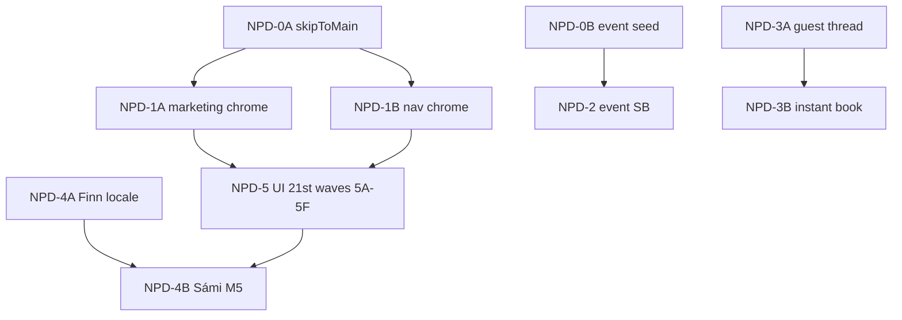

# Hjerterum — NPD-plan (Neste Pilot-Deliverables)

**Versjon:** 1.1 · Juli 2026  
**Formål:** Prioritert leveranseplan etter to automatiserte audit-kjøringer mot `hjerterom-phi.vercel.app` (1. juli 2026), utvidet med **NPD-5 verdensklasse UI/UX** basert på [21st.dev](https://21st.dev)-kuratering.  
**Kilder:**

| Audit | Resultatfil | Score |
|-------|-------------|-------|
| UX/UI (`/ux-ui-audit`) | `docs/hjerterum/UX_UI_AUDIT_RESULTS.txt` | 24 PASS · 2 WARN · **1 FAIL** |
| Product growth (`/product-growth-audit`) | `docs/hjerterum/audits/PRODUCT_GROWTH_AUDIT_RESULTS.txt` | 36 PASS · 6 WARN · **1 FAIL** |

**Relatert:** `PRD.md` §15, `UI_UX_GOVERNANCE.md` §6, `PRODUKTANALYSE_AKTORER.md`, `DEMO_NARVIK_OFOTEN.md`, [`NPD_5_UI_DESIGN_REFRESH.md`](./audits/NPD_5_UI_DESIGN_REFRESH.md)

**Status phi:** Pilot-klar med **to felles blockers** og seks UX-advarsler. NPD-0–4 lukker funksjon og i18n; **NPD-5** leverer visuell kvalitet uten å overbelaste brukeren.

---

## 1. Executive summary

Phi-deploymenten støtter salgsdemo for Ofoten/Narvik: alle offentlige modul-innganger returnerer 200, ops/kommune/utleier/leietaker-reiser fungerer, og Finn/Los har mørk default med språkvelger i shell.

**Felles blockers (må lukkes før pilot-sign-off):**

1. **`skipToMain` mangler i18n** — SkipLink viser rå nøkkel på alle sider (WCAG + PRD §15.10).
2. **`kari.event@demo.ofoten.no` kan ikke logge inn** — event_ansatt-reisen er utestet; sannsynlig seed/`central_event_staff`-gap på phi Supabase.

**NPD-5 (nytt i v1.1):** 20 kuraterte [21st.dev](https://21st.dev)-mønstre implementeres **progressivt** — én visuell familie (Boly tokens + shadcn), **maks én ny interaksjonstype per skjerm**, ingen dekor uten jobb. Full spec: [`NPD_5_UI_DESIGN_REFRESH.md`](./audits/NPD_5_UI_DESIGN_REFRESH.md).

---

## 2. Konsolidert funnmatrise

| ID | Kilde | Alvorlighet | Område | Beskrivelse |
|----|-------|-------------|--------|-------------|
| NPD-B1 | UX | **FAIL** | i18n / a11y | `skipToMain` mangler `no`/`se`/`en` i `lib/i18n` |
| NPD-B2 | Growth | **FAIL** | Demo / auth | `kari.event@demo.ofoten.no` — login feiler på phi |
| NPD-W1 | Growth | WARN | Marketing | `/` — ingen theme toggle eller språkvelger |
| NPD-W2 | Growth | WARN | Auth | `/login` — språkvelger ikke i initial HTML |
| NPD-W3 | UX | WARN | Nav | Theme toggle ikke funnet i header ved 1280px |
| NPD-W4 | UX | WARN | Nav | Locale selector med `se` ikke funnet på `/nav/database` desktop |
| NPD-W5 | Growth | WARN | Hydration | Theme toggle «false negative» før client load på `/finn`, `/los`, `/login` |
| NPD-W6 | Growth | WARN | i18n | Finn underside viser engelsk mens nav er norsk |
| NPD-I1 | Growth | INFO | Produkt P0 | Meldingstråd leietaker↔utleier per booking |
| NPD-I2 | Growth | INFO | Produkt P0 | `tourism_instant_book` — manuell E2E |
| NPD-I3 | Growth | INFO | Produkt | Dedikert `event_ansatt`-UI (delvis `/nav/event/*`) |
| NPD-I4 | Growth | INFO | Betaling | Stripe + Vipps parallelt |
| NPD-I5 | Growth | INFO | i18n | M5 Sámi-nøkkelaudit på alle nye strenger |
| NPD-I6 | Growth | INFO | Booking | First-book-wins / dobbelbooking concurrency-test |

---

## 3. Leveransespor (NPD)

### Spor 0 — Audit-blockers (P0, parallell)

| Brief | Scope | Eier | Avhengighet |
|-------|-------|------|-------------|
| NPD-0A | Legg til `skipToMain` i `common.ts` (`no`/`se`/`en`); verifiser SkipLink | 1 agent | — |
| NPD-0B | Re-kjør demo-seed på phi; verifiser `event_ansatt` + `central_event_staff` for Kari | Ops + 1 agent | — |

**Gate:** Begge audit-scripts har 0 FAIL på auth + skip link.

---

### Spor 1 — Universal Boly chrome (P1)

| Brief | Scope | PRD | 21st.dev støtte |
|-------|-------|-----|-----------------|
| NPD-1A | Theme + språk på `/` og `/login` | §15.3 | [#1 Toggle theme](#21st-komponentregister) |
| NPD-1B | Synlig theme + `se` i Boly App header ≥1280px | §15.3 | [#1](#21st-komponentregister) |

**Gate:** Manuell sjekk 320px + 1280px på `/`, `/login`, `/nav/database` i begge temaer.

---

### Spor 2 — Event saksbehandler-reise (P1)

| Brief | Scope | Avhengighet |
|-------|-------|-------------|
| NPD-2 | Login → isolert `/nav/event/*`; smoke event_sb persona | NPD-0B, shell [#5](#21st-komponentregister) |

---

### Spor 3 — Vekst-P0 produkt (P1–P2)

| Brief | Scope | 21st.dev støtte |
|-------|-------|-----------------|
| NPD-3A | Meldingstråd per turisme-booking | [#8 Messaging Conversation](#21st-komponentregister) |
| NPD-3B | Instant book E2E | [#14 Stepper with labels](#21st-komponentregister) |
| NPD-3C | Vipps parallelt Stripe | [#20 Alert / confirm](#21st-komponentregister) |
| NPD-3D | First-book-wins concurrency | — |

---

### Spor 4 — i18n & kvalitet (P1 release-gate)

| Brief | Scope | Gate |
|-------|-------|------|
| NPD-4A | Finn undersider følger valgt locale | WARN NPD-W6 |
| NPD-4B | `npm run i18n-audit` — 100% `se` | PRD §15.8 M5 |

---

### Spor 5 — Verdensklasse UI/UX uten overload (P1 pilot sign-off)

**Spec:** [`audits/NPD_5_UI_DESIGN_REFRESH.md`](./audits/NPD_5_UI_DESIGN_REFRESH.md)

| Wave | Fokus | Komponenter (#) | Brukerbelastning |
|------|-------|-----------------|------------------|
| **5A** | Tokens + chrome | 1, 2, 3 | Én kontrollrad: theme + språk |
| **5B** | App shell | 4, 5, 6 | Én sidebar; badges kun for uleste |
| **5C** | Arbeidsflater | 7, 8, 9, 10 | Én primær handling per rad/kort |
| **5D** | Finn turisme | 11, 12, 13, 14 | Søk = 3 felt; kart valgfritt fold |
| **5E** | Los + onboarding | 15, 16, 17, 18 | Én chat; steg synlig, ikke wizard-overload |
| **5F** | Ops + tillit | 19, 20 | KPI-kort maks 4; alerts kun ved handling |

**Gate:** Alle persona-reiser (Tina, Tommy, Emma, guest) i §5 i NPD-5-doc + 0 kontrast-blokkere.

---

## 4. 21st.dev — topp 20 (kuratert for Hjerterum)

Alle installeres via `npx shadcn@latest add https://21st.dev/r/<author>/<slug>` (eller `@21st-dev/cli`), deretter **token-map** til `globals.css` og **i18n** (`no`/`se`/`en`). Ingen rå engelsk i prod.

| # | Komponent | 21st.dev | Primær rute | Hvorfor Hjerterum | Overload-grep |
|---|-----------|----------|-------------|-------------------|---------------|
| 1 | Toggle theme | [shadcnspace/toggle-theme](https://21st.dev/community/components/shadcnspace/toggle-theme) | Alle shells | Mørk default + brukervalg; PRD §15.2 | Én ikon-knapp i chrome |
| 2 | StatusBadge | [uniquesonu/status-badge](https://21st.dev/community/components/uniquesonu/status-badge-beautiful-accessible-status-indicators) | Listing, booking, formidling | 6 tilstander, WCAG, mørk/lys | Erstatt 3+ ad-hoc status-stiler |
| 3 | Hero Section Dark | [kinfe123/hero-section-dark](https://21st.dev/community/components/kinfe123/hero-section-dark/default) | `/` | Mørk first paint; Nord-Norge tillit | **Kun landing** — ikke i app |
| 4 | Feature Section (hover) | [aceternity/feature-section-with-hover-effects](https://21st.dev/community/components/aceternity/feature-section-with-hover-effects) | `/` portal-kort | Fire baner uten fire sider | Hover valgfritt; touch = statisk |
| 5 | Dashboard + sidebar | [uniquesonu/dashboard-with-collapsible-sidebar](https://21st.dev/community/components/uniquesonu/dashboard-with-collapsible-sidebar/default) | `/nav/*`, `/homeowner/*` | Collapse + aktivitet; mørk innebygd | Ikke bruk full demo-dashboard — kun shell |
| 6 | Modern Sidebar | [uniquesonu/modern-side-bar](https://21st.dev/community/components/uniquesonu/modern-side-bar/default) | Mobil app shell | Badge på meldinger/varsler | Skjul søk til P2 |
| 7 | Table sort + search | [shadcn/table/with-sorting-and-search](https://21st.dev/community/components/shadcn/table/with-sorting-and-search) | `/nav/database` | Boligbank kjerne | Filter **collapsible** på mobil |
| 8 | Messaging Conversation | [hextaui/messaging-conversation](https://21st.dev/community/components/hextaui/messaging-conversation/default) | `/nav/messages`, booking-tråd | Menneskelig formidling, ikke AI-støy | Ingen typing-indikator på SB-tråd |
| 9 | Property Card | [ravikatiyar/card-4](https://21st.dev/community/components/ravikatiyar/card-4) | `/finn`, `/finn/search` | Listing-kort med CTA | Maks 1 CTA per kort |
| 10 | Calendar booked days | [shadcn/calendar-with-booked-days](https://21st.dev/community/components/shadcn/calendar-with-booked-days) | `/homeowner/manage` | Lane-kalender `--lane-*` | Fargelegende foldet under kalender |
| 11 | Range selection calendar | [shadcn/calendar-with-range-selection](https://21st.dev/community/components/shadcn/calendar-with-range-selection/default) | `/finn` søk | Innsjekk/utsjekk | Popover, ikke fullside |
| 12 | mapcn LayerMarkers | [mapcn/mapcn-layer-markers](https://21st.dev/@mapcn/components/mapcn-layer-markers) | `/finn` kart | Theme-aware kart; erstatter placeholder | Kart **under** liste på mobil |
| 13 | Visualize Booking | [ln-dev7/visualize-booking](https://21st.dev/community/components/ln-dev7/visualize-booking/default) | `/finn/mine` | Status tidslinje for gjest | Én vertikal tidslinje |
| 14 | Stepper with labels | [originui/stepper/with-labels](https://21st.dev/community/components/originui/stepper/with-labels) | `/finn/book`, `/los` | 3 steg synlig; reduserer angst | Ikke klikkbare fremtidige steg |
| 15 | AgentChat + InputBar | [Agent Elements](https://agent-elements.21st.dev/docs/agent-chat) | `/los` | Streaming, spørsmål-UI for ungdom | **Kun Los** — ikke i nav |
| 16 | Registration Stepper | [ravikatiyar/registration-stepper](https://21st.dev/community/components/ravikatiyar/registration-stepper/default) | `/homeowner/register` | Utleier onboarding | Maks 5 steg; lagre utkast |
| 17 | Identity Verification Dialog | [ruixen.ui/identity-verification-dialog](https://21st.dev/community/components/ruixen.ui/identity-verification-dialog) | BankID-flyt | Forventningsstyring før Signicat | Modal, ikke ny side |
| 18 | File Upload Card | [ravikatiyar162/file-upload-card](https://21st.dev/community/components/ravikatiyar162/file-upload-card) | Listing galleri | Drag-drop bilder | Progress inline; ingen modal-kjede |
| 19 | Gallery Grid + Lightbox | [reapollo/gallery-grid-block-shadcnui](https://21st.dev/community/components/reapollo/gallery-grid-block-shadcnui/default) | Listing detail | Profesjonell boligpresentasjon | Lightbox on demand |
| 20 | Statistics Card 12 | [reui/statistics-card-12](https://21st.dev/community/components/reui/statistics-card-12) | `/ops/stats` | KPI uten støy | Maks 4 kort above fold |

**Bevisst utelatt** (for å unngå overload): floating docks, shader heroes, animated status badges, offers carousel, financial dashboard demo, multi-step login duplikat, tilted dock parallax.

---

## 5. Avhengighetsgraf

```mermaid
flowchart TD
  B1[NPD-0A skipToMain]
  B2[NPD-0B event seed]
  M1[NPD-1A marketing chrome]
  M2[NPD-1B nav chrome]
  E2[NPD-2 event SB]
  G1[NPD-3A guest thread]
  G2[NPD-3B instant book]
  I1[NPD-4A Finn locale]
  I2[NPD-4B Sámi M5]
  U5[NPD-5 UI 21st waves 5A-5F]

  B1 --> M1
  B1 --> M2
  B2 --> E2
  M1 --> U5
  M2 --> U5
  G1 --> G2
  I1 --> I2
  U5 --> I2
```

**Anbefalt rekkefølge:** Spor 0 → 1 → (2 parallelt 4A) → 3 → **5A–5B (shell)** → 5C–5F → 4B (Sámi audit til slutt).

---

## 6. Wave-indeks

| Brief | Status | Estimat |
|-------|--------|---------|
| NPD-0A | Klar | Liten |
| NPD-0B | Klar | Liten |
| NPD-1A / 1B | Klar | Medium |
| NPD-2 | Blokkert av 0B | Liten |
| NPD-3A–3D | Klar | Medium–stor |
| NPD-4A / 4B | Klar | Medium |
| **NPD-5** | **Plan v1.1** | Stor (6 bølger, 20 komponenter) |

---

## 7. Definition of done (NPD komplett)

### 7.1 Audit-gates

- [ ] UX/UI audit — **0 FAIL**
- [ ] Product growth audit — **0 FAIL**
- [ ] Manuell booking emma → ingrid (accept + betaling)

### 7.2 UX / PRD §15 + NPD-5

- [ ] Theme + `no`/`se`/`en` på alle flater (desktop + mobil)
- [ ] 20 komponenter integrert **eller** bevisst utsatt med ticket (maks 3 utsettelser)
- [ ] Ingen skjerm med >1 primær CTA eller >7 nav-punkter synlige samtidig (overload-regel)
- [ ] M5 Sámi: `npm run i18n-audit` grønn

### 7.3 Pilot-demo (Ofoten)

- [ ] Alle personaer i `DEMO_NARVIK_OFOTEN.md` på phi
- [ ] Event SB isolert rute OK
- [ ] `/ops/stats` laster

---

## 8. Re-audit-kadence

| Når | Handling |
|-----|----------|
| Etter NPD-0 | Begge audit-scripts |
| Etter NPD-5 wave 5B | Shell screenshot diff (dark/light) |
| Før pilot-sign-off | Full persona-smoke + NPD-5 §8 sign-off |
| Kvartalsvis | `UI_UX_GOVERNANCE.md` §6.2 |

---

*NPD-planen erstatter ikke `UTVIKLINGSPLAN.md` — den er den operative køen til pilot-sign-off. NPD-5 er den visuelle kvalitetslinjen: verdensklasse uten feature creep.*
