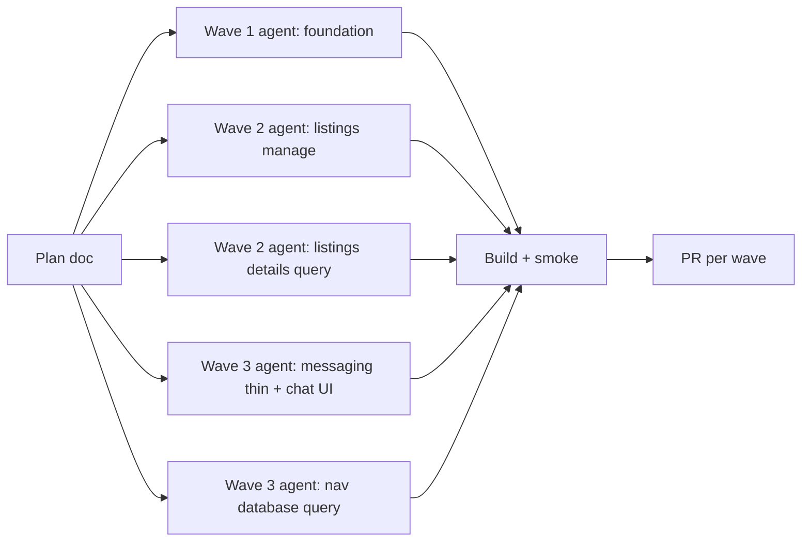

# Hjerterum — full-app refactor plan

> **Formål:** Gjøre hele kodebasen enklere, raskere å endre, og konsistent med `SERVICE_FLOW.md` og `UTVIKLINGSPLAN.md`.  
> **Versjon:** 1.0 · 2026-06-30  
> **Relatert:** `SERVICE_FLOW.md`, `ARCHITECTURE.md`, `UTVIKLINGSPLAN.md` §3 (målarkitektur), **`agents/README.md`** (smart-zone agent briefs per wave)

---

## 1. Mål og prinsipper

| Mål | Målbare kriterier |
|-----|-------------------|
| **Enkelhet** | Ingen fil > 800 linjer; route `page.tsx` < 50 linjer |
| **Effektivitet** | Felles data-hooks (React Query); ingen duplisert fetch for samme entitet |
| **Kvalitet** | 0 nye `confirm()`/`alert()`; konsistent loading (skeleton/spinner); ESLint håndhever |
| **Produkt-alignment** | Tre baner (sosial/turisme/event) er synlige i kode-grenser, ikke bare i docs |

**Regler under refactor:**

1. **Ingen funksjonell regressjon** — hver PR har smoke-test sjekkliste (utleier manage, nav database, meldinger, finn søk).
2. **Vertikal slicing** — flytt kode til `features/<domene>/`, ikke nye `utils/` mega-mapper.
3. **Tynn routing** — `app/**/page.tsx` re-eksporterer fra features.
4. **Én kilde per sannhet** — query keys, nav items, region parsing, channel labels.
5. **Små PR-er** — maks ~500 linjer netto endring per wave-del; enkel review og rollback.

---

## 2. Nåtilstand (baseline)

**Frontend:** ~119k LOC TypeScript/TSX (ekskl. node_modules).

**Megasider (refactor-kritisk):**

| Fil | Linjer | % av listings/nav cluster |
|-----|--------|---------------------------|
| `features/listings/components/ListingDetailsClient.tsx` | ~4,952 | Eier listing + nav + formidling + gallery |
| `features/mediation/components/NavDatabasePage.tsx` | ~3,358 | Boligbank (kommune + event) |
| `features/listings/components/LandlordManagePage.tsx` | ~2,040 | Utleier dashboard |
| `app/nav/messages/page.tsx` | ~2,001 | Unified inbox |

**Allerede godt faktored:** lane calendar (`ListingLaneCalendar`, `LandlordAvailabilityHub`), ops events, finn route shells, design-system toast.

**Teknisk gjeld (prioritert):**

- `useListingAvailability` finnes men brukes ikke
- Event-fetch duplisert 4 steder
- `parseKommuneRegions` duplisert i mediation
- Chat-bubble UI kopiert 3 ganger
- 4 gjenværende native `confirm()` (resten er toast)
- Inkonsistent loading (`PageSkeleton` vs `LoadingPlaceholder` vs ren tekst)

---

## 3. Målarkitektur (kort)

```
frontend/
  app/
    (marketing)/     → hjerterum.no
    (app)/           → app.* — tynne page.tsx
    (finn)/          → finn.*
    (los)/           → los.*
    (ops)/           → ops.*
  features/
    listings/        → CRUD, manage, detail (owner view)
    mediation/       → boligbank, formidling, nav notes
    messaging/       → alle chat-tråder
    events/          → central events + opt-in queries
    tourism/         → finn booking UI
    los/             → Digital Los
    auth/            → gates, post-login routing
  components/
    design-system/   → Toast, ConfirmDialog, PageSkeleton, EmptyState
  lib/
    supabase/
    queries/         → delte queryFn + QK.*
```

**Persona-split for listing detail:**

- `ListingDetailsOwnerView` — utleier redigering
- `ListingDetailsNavView` — kommune/event SB (formidling, notater)
- `ListingDetailsPublicView` — offentlig (hvis aktuelt)

---

## 4. Bølger (waves)

### Wave 0 — Dokumentasjon og baseline ✅

| ID | Leveranse | Status |
|----|-----------|--------|
| 0.1 | `SERVICE_FLOW.md` kanonisk flyt | ✅ PR #20 |
| 0.2 | `REFACTOR_PLAN.md` (dette dokumentet) | ✅ |
| 0.3 | Måle megasider + agent-kartlegging | ✅ |

---

### Wave 1 — Foundation & quick wins (P0)

**Mål:** Felles primitives og umiddelbar reduksjon av duplikat uten store flytt.

| ID | Oppgave | Filer | Akseptanse |
|----|---------|-------|------------|
| 1.1 | Wire `useListingAvailability` i manage | `LandlordManagePage.tsx` | Inline CRUD fjernet |
| 1.2 | Fjern duplikat `parseKommuneRegions` | `NavDatabasePage.tsx` | Importer fra `app/lib/kommuneRegions` |
| 1.3 | `useConfirm` for alle native `confirm()` | 4 call sites | 0 `confirm()` i frontend |
| 1.4 | `useDisplayNamesBatch` hook | messaging | Dedup i messages + event messages |
| 1.5 | `useAsyncQuery` hook | `app/hooks/` | Pilot: 1 finn-side |
| 1.6 | ESLint: `no-alert`, `no-restricted-globals` for confirm | `eslint.config` | CI feiler på nye alerts |

**Estimat:** Lav risiko, ~400–800 linjer netto reduksjon.

---

### Wave 2 — Megasite decomposition: listings (P0)

**Mål:** `LandlordManagePage` og start på `ListingDetailsClient`.

| ID | Oppgave | Ny struktur |
|----|---------|-------------|
| 2.1 | `useLandlordManageBootstrap` | pageGate, welcome, PWA, onboarding |
| 2.2 | `useLandlordListingsQuery` | Erstatt `fetchData` med React Query |
| 2.3 | Split manage UI | `LandlordListingCard`, `LandlordListingActionSheet`, `ConfirmDeleteDialog` |
| 2.4 | `usePublishedEventsQuery` | Feed calendar, opt-in, task cards |
| 2.5 | `useListingDetailsQuery` | Ekstraher 170-linje useEffect |
| 2.6 | `ListingGallerySection` + `ListingNavStickySidebar` | Første to JSX-splits fra details |

**Mål-linjetall:** Manage ~200 linjer shell; Details ~800 linjer shell etter wave 2.

---

### Wave 3 — Megasite decomposition: nav + messaging (P0)

| ID | Oppgave | Ny struktur |
|----|---------|-------------|
| 3.1 | Thin route: `NavMessagesPage` | `app/nav/messages/page.tsx` → re-export |
| 3.2 | `ChatMessageBubble` + `ChatComposer` | Delt av 3 chat-flater |
| 3.3 | `useEventStaffAccess` | Erstatt 3 inline auth effects |
| 3.4 | `useNavDatabaseListingsQuery` (ekte) | Flytt `fetchListings` fra megasite |
| 3.5 | `FormidletModal` / `FormidletExtendModal` | Ekstraher fra NavDatabasePage |
| 3.6 | `NavDatabaseTimeline` + `NavDatabaseFilters` | JSX-splits |

**Mål-linjetall:** NavDatabasePage ~600 linjer shell; messages route ~15 linjer.

---

### Wave 4 — Shared data layer & gates (P1)

| ID | Oppgave |
|----|---------|
| 4.1 | Sentral `QK` (query keys) modul |
| 4.2 | `useAuthGate({ mode })` — landlord / kommune / chat / ops / event |
| 4.3 | `useTermsGate(scope: 'event' \| 'tourism')` |
| 4.4 | `chatSend.ts` — insert + notify per channel |
| 4.5 | Invalidation bridge: manage mutations → nav database cache |

---

### Wave 5 — Persona views & finn async (P1)

| ID | Oppgave |
|----|---------|
| 5.1 | `ListingDetailsOwnerView` / `ListingDetailsNavView` |
| 5.2 | Flytt formidling-logikk til `features/mediation/hooks/useListingMediation` |
| 5.3 | `useAsyncQuery` på alle finn-sider |
| 5.4 | `PortalPageShell` — unified loading per subdomain |
| 5.5 | Ops skeleton → wrap design-system `PageSkeleton` |

---

### Wave 6 — Polish & enforcement (P2)

| ID | Oppgave |
|----|---------|
| 6.1 | Subdomain route groups `(app)` / `(finn)` fysisk flytt |
| 6.2 | i18n: splitt `translations.ts` (4728 linjer) per feature |
| 6.3 | Playwright smoke per wave |
| 6.4 | Bundle analyse; dynamic import for gallery/handover |

---

## 5. Agent-arbeidsflyt

Hver wave kjøres som **parallelle agenter** med tydelige grenser:



**Agent-instruks (mal):**

1. Les `SERVICE_FLOW.md` § relevant bane
2. Kun endre filer i tildelt wave-ID
3. Kjør `npm run build` i `frontend/`
4. Oppdater modulstatus i `SERVICE_FLOW.md` §7 hvis UX endres
5. Commit med prefix `refactor(wave-N):`

---

## 6. Risiko og mitigering

| Risiko | Mitigering |
|--------|------------|
| Regresjon i formidling | Behold RPC-navn; manuell smoke: mark/extend/remove formidlet |
| Spinner-regresjon (manage) | Behold `landlordManagePageGate.ts` tester |
| Chat realtime duplikat | Én `useChatRealtime` før UI-split |
| For stor PR | Hard stop ved 800 netto linjer; del opp |

---

## 7. Suksesskriterier (ferdig refactor)

- [ ] Ingen TSX-fil > 800 linjer
- [ ] Alle `app/**/page.tsx` under 50 linjer (unntak dokumentert)
- [ ] 0 `confirm()` / `alert()`
- [ ] `useListingAvailability`, `usePublishedEventsQuery`, `useNavDatabaseListingsQuery` i bruk
- [ ] `SERVICE_FLOW.md` §7 modulstatus = «Ferdig» for utleier manage, nav database, meldinger
- [ ] `npm run build` grønn; eslint grønn

---

## 8. Endringslogg

| Dato | Versjon | Endring |
|------|---------|---------|
| 2026-06-30 | 1.0 | Første plan basert på agent-kartlegging og megafil-måling |
