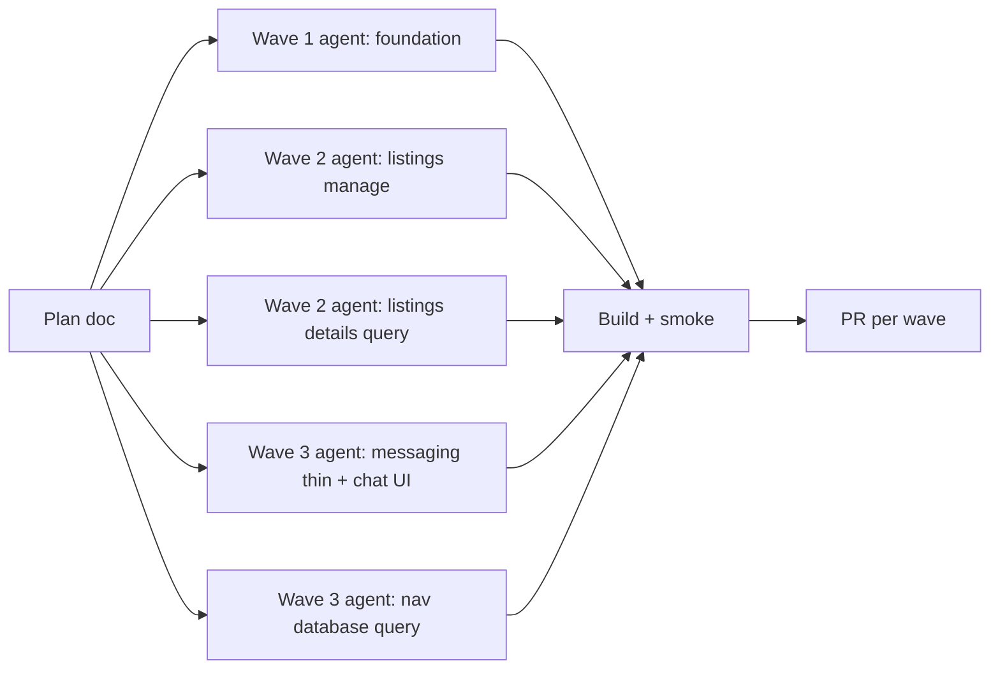

# Hjerterum — full-app refactor plan

> **Formål:** Gjøre hele kodebasen enklere, raskere å endre, og konsistent med `SERVICE_FLOW.md` og `UTVIKLINGSPLAN.md`.  
> **Versjon:** 1.0 · 2026-06-30  
> **Relatert:** `SERVICE_FLOW.md`, `ARCHITECTURE.md`, `UTVIKLINGSPLAN.md` §3 (målarkitektur), **`agents/README.md`** (smart-zone agent briefs per wave)

---

## 1. Mål og prinsipper

| Mål | Målbare kriterier |
|-----|-------------------|
| **Enkelhet** | Ingen fil > 800 linjer; route `page.tsx` < 50 linjer |
| **Effektivitet** | Felles data-hooks (React Query); ingen duplisert fetch for samme entitet |
| **Kvalitet** | 0 nye `confirm()`/`alert()`; konsistent loading (skeleton/spinner); ESLint håndhever |
| **Produkt-alignment** | Tre baner (sosial/turisme/event) er synlige i kode-grenser, ikke bare i docs |

**Regler under refactor:**

1. **Ingen funksjonell regressjon** — hver PR har smoke-test sjekkliste (utleier manage, nav database, meldinger, finn søk).
2. **Vertikal slicing** — flytt kode til `features/<domene>/`, ikke nye `utils/` mega-mapper.
3. **Tynn routing** — `app/**/page.tsx` re-eksporterer fra features.
4. **Én kilde per sannhet** — query keys, nav items, region parsing, channel labels.
5. **Små PR-er** — maks ~500 linjer netto endring per wave-del; enkel review og rollback.

---

## 2. Nåtilstand (baseline)

**Frontend:** ~119k LOC TypeScript/TSX (ekskl. node_modules).

**Megasider (refactor-kritisk — oppdatert etter wave 1–4):**

| Fil | Baseline | Nå | Endring |
|-----|----------|-----|---------|
| `ListingDetailsClient.tsx` | ~4,952 | ~4,782 | Query hook extractet; JSX-split gjenstår (W5) |
| `NavDatabasePage.tsx` | ~3,358 | ~3,031 | React Query listings; timeline/filter gjenstår |
| `LandlordManagePage.tsx` | ~2,040 | ~1,695 | Bootstrap + listings hooks + ConfirmDeleteDialog |
| `app/nav/messages/page.tsx` | ~2,001 | **19** | ✅ Tynn re-export → `NavMessagesPage.tsx` |

**Allerede godt faktored:** lane calendar, ops events, finn React Query, `usePublishedEventsQuery`, `useEventStaffAccess`, design-system toast/confirm.

**Teknisk gjeld (gjenstår):**

- `ListingDetailsClient` JSX persona-split (W5)
- Chat-bubble UI kopiert 3 ganger (W4 follow-up: `chatSend` + shared composer)
- `NavMessagesPage` (~1,951 linjer) — innhold flyttet, decomposition gjenstår
- ~~`translations.ts` monolith (W6)~~ → splittet i `lib/i18n/*` (W6 ✅)
- Generert `database.types.ts` (P0 doc — krever lokal Supabase)

---

## 3. Målarkitektur (kort)

```
frontend/
  app/
    (marketing)/     → hjerterum.no
    (app)/           → app.* — tynne page.tsx
    (finn)/          → finn.*
    (los)/           → los.*
    (ops)/           → ops.*
  features/
    listings/        → CRUD, manage, detail (owner view)
    mediation/       → boligbank, formidling, nav notes
    messaging/       → alle chat-tråder
    events/          → central events + opt-in queries
    tourism/         → finn booking UI
    los/             → Digital Los
    auth/            → gates, post-login routing
  components/
    design-system/   → Toast, ConfirmDialog, PageSkeleton, EmptyState
  lib/
    supabase/
    queries/         → delte queryFn + QK.*
```

**Persona-split for listing detail:**

- `ListingDetailsOwnerView` — utleier redigering
- `ListingDetailsNavView` — kommune/event SB (formidling, notater)
- `ListingDetailsPublicView` — offentlig (hvis aktuelt)

---

## 4. Bølger (waves)

### Wave 0 — Dokumentasjon og baseline ✅

| ID | Leveranse | Status |
|----|-----------|--------|
| 0.1 | `SERVICE_FLOW.md` kanonisk flyt | ✅ PR #20 |
| 0.2 | `REFACTOR_PLAN.md` (dette dokumentet) | ✅ |
| 0.3 | Måle megasider + agent-kartlegging | ✅ |

---

### Wave 1 — Foundation & quick wins ✅

**Mål:** Felles primitives og umiddelbar reduksjon av duplikat uten store flytt.

| ID | Oppgave | Status |
|----|---------|--------|
| 1.1–1.6 | Se `agents/W1-foundation.md` | ✅ |

---

### Wave 2 — Megasite decomposition: listings ✅ (delvis)

| ID | Oppgave | Status |
|----|---------|--------|
| 2.1 | `useLandlordManageBootstrap` | ✅ |
| 2.2 | `useLandlordListingsQuery` | ✅ |
| 2.3 | `ConfirmDeleteDialog`; card/sheet split | 🔶 Dialog ✅; card/sheet → W2b brief |
| 2.4 | `usePublishedEventsQuery` | ✅ (W4) |
| 2.5 | `useListingDetailsQuery` | ✅ |
| 2.6 | Gallery + nav sidebar JSX splits | 🔶 W5 |

---

### Wave 3 — Megasite decomposition: nav + messaging ✅ (delvis)

| ID | Oppgave | Status |
|----|---------|--------|
| 3.1 | Thin route: `NavMessagesPage` | ✅ (19 linjer route) |
| 3.2 | `ChatMessageBubble` + `ChatComposer` | 🔶 W4 follow-up |
| 3.3 | `useEventStaffAccess` | ✅ |
| 3.4 | `useNavDatabaseListingsQuery` | ✅ |
| 3.5 | Formidlet modals | 🔶 Neste agent-brief |
| 3.6 | Timeline + filters JSX | 🔶 Neste agent-brief |

---

### Wave 4 — Shared data layer & gates ✅ (delvis)

| ID | Oppgave | Status |
|----|---------|--------|
| 4.1 | Sentral `QK` | ✅ utvidet (finn, events, eventStaff) |
| 4.2 | `useAuthGate` unified | 🔶 `useEventStaffAccess` ✅; rest gjenstår |
| 4.3 | `useTermsGate` | 🔶 W5 |
| 4.4 | `chatSend.ts` | 🔶 W4b brief |
| 4.5 | Invalidation bridge | 🔶 Delvis (nav database invalidate) |
| — | `usePublishedEventsQuery` | ✅ |
| — | Slett `useAsyncQuery`; finn → React Query | ✅ |

---

### Wave 5 — Persona views & finn async 🔶 (delvis)

| ID | Oppgave | Status |
|----|---------|--------|
| 5.1 | Persona views for listing detail | 🔶 `ListingDetailsOwnerView` / `NavView` påbegynt |
| 5.2 | `useListingMediation` | 🔶 Hook ekstrahert |
| 5.3 | Finn async (mine, book) | 🔶 Søk ✅ |
| 5.4 | `PortalPageShell` | 🔶 |
| 5.5 | Ops skeleton unify | 🔶 |

---

### Wave 6 — Polish & enforcement 🔶 (delvis)

| ID | Oppgave | Status |
|----|---------|--------|
| 6.1 | Subdomain route groups `(app)` / `(finn)` fysisk flytt | ⏭️ Utelatt (middleware-risiko) |
| 6.2 | i18n: splitt `translations.ts` per feature | ✅ `lib/i18n/{common,listings,nav,finn,ops}.ts` |
| 6.3 | Playwright smoke per wave | ✅ `e2e/smoke.spec.ts` (manage, nav/database, nav/messages, finn) |
| 6.4 | Bundle analyse; dynamic import for gallery/handover | 🔶 |
| 6.5 | ESLint `max-lines` warn 800 for `app/` + `features/` TSX | ✅ |

---

## 5. Agent-arbeidsflyt

Hver wave kjøres som **parallelle agenter** med tydelige grenser:



**Agent-instruks (mal):** Se **`docs/hjerterum/agents/README.md`** — hver wave har egen brief-fil for smart-zone context windows.

---

## 6. Risiko og mitigering

| Risiko | Mitigering |
|--------|------------|
| Regresjon i formidling | Behold RPC-navn; manuell smoke: mark/extend/remove formidlet |
| Spinner-regresjon (manage) | Behold `landlordManagePageGate.ts` tester |
| Chat realtime duplikat | Én `useChatRealtime` før UI-split |
| For stor PR | Hard stop ved 800 netto linjer; del opp |

---

## 7. Suksesskriterier (ferdig refactor)

- [ ] Ingen TSX-fil > 800 linjer (ESLint warn håndhever fra W6)
- [ ] Alle `app/**/page.tsx` under 50 linjer (unntak dokumentert)
- [ ] 0 `confirm()` / `alert()`
- [ ] `useListingAvailability`, `usePublishedEventsQuery`, `useNavDatabaseListingsQuery` i bruk
- [x] `SERVICE_FLOW.md` §8 modulstatus oppdatert for utleier manage, nav database, meldinger (W6)
- [x] `npm run build` grønn; eslint grønn

---

## 8. Endringslogg

| Dato | Versjon | Endring |
|------|---------|---------|
| 2026-06-30 | 1.0 | Første plan basert på agent-kartlegging og megafil-måling |
| 2026-07-01 | 1.1 | W5–6 status: i18n split, ESLint max-lines, Playwright smoke stub |
