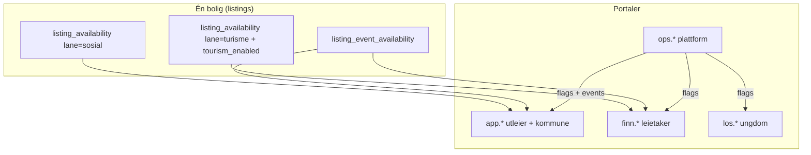

# Hjerterum — tjenesteflyt (kanonisk oversikt)

> **Formål:** Én redigerbar referanse for hele økosystemet — hvem gjør hva, i hvilken rekkefølge, og hva som må være på plass før neste steg.  
> **Bruk:** Oppdater dette dokumentet når produkt, ruter eller gates endres. Agent og utviklere kan lese dette for vedvarende kontekst.  
> **Versjon:** 1.0 · 2026-06-30  
> **Relatert:** `ARCHITECTURE.md`, `PRODUKTANALYSE_AKTORER.md`, `BRUKERVEILEDNING.md`, `DEMO_NARVIK_OFOTEN.md`

---

## Slik redigerer du dette dokumentet

| Seksjon | Når du oppdaterer |
|---------|-------------------|
| **§1 Mental modell** | Ny portal, ny rolle, ny «bane» |
| **§2 Aktører** | Ny `profiles.role`, ny inngang URL |
| **§3 Flyt per aktør** | Endring i brukerreise (UI-steg) |
| **§4 Avtaler & gates** | Nye vilkår, RPC, middleware-regler |
| **§5 Data & entiteter** | Nye tabeller som kobler flyter |
| **§6 Forvirringspunkter** | Support/UX lærer noe nytt — dokumenter det |
| **§7 Modulstatus** | Ferdig / pilot / planlagt per modul |

Legg til rad under **Endringslogg** nederst ved hver større oppdatering.

---

## 1. Mental modell (les dette først)

Hjerterum er **én boligpool** med **tre parallelle formål** (baner). Samme fysiske bolig kan være åpen for flere formål samtidig, men hver bane har **egne regler, avtaler og innbokser**.



### De tre banene (aldri bland disse i UX-tekst)

| Bane | Farge i utleier-kalender | Hvem «eier» tilgjengelighet | Hvem booker / formidler | Avtale |
|------|--------------------------|----------------------------|-------------------------|--------|
| **Sosial** | Blå | Utleier markerer perioder; **kommune formidler** | Kommune saksbehandler → sosial leietaker | Regional kommune-PDF (BankID) |
| **Turisme** | Teal | Utleier: slå på turisme + mal perioder | Leietaker på **Finn** (direkte) | Turisme-vilkår (BankID) |
| **Arrangement** | Lilla | Utleier: opt-in per event | Avhenger av `routing_mode` (se §3.5) | Event-vilkår per arrangement (BankID) |

**Viktig:** Sosial formidling skjer **aldri** på Finn. Turisme skjer **aldri** via kommune-boligbank. Event kan gå via saksbehandler **eller** Finn booking — avhenger av ops-innstilling.

---

## 2. Aktører og innganger

| Aktør | Rolle / identitet | Primær inngang | Subdomene |
|-------|-------------------|----------------|-----------|
| **Utleier** | `profiles.role = homeowner` | `/homeowner/manage` | `app.*` |
| **Kommune SB** | `kommune_ansatt` + `user_kommune_grants` | `/nav/database` | `app.*` |
| **Kommune admin** | `kommune_admin` | + `/nav/terms-documents`, `/nav/kommune-access` | `app.*` |
| **Event SB** | `event_ansatt` + `central_event_staff` | `/nav/event/database` | `app.*` (isolert nav) |
| **Leietaker (Finn)** | Auth + `guest_profiles` | `/finn` | `finn.*` |
| **Ungdom (Los)** | Anonym `los_sessions` | `/los` | `los.*` |
| **Plattform (Ops)** | `platform_operators` (ikke profile-rolle) | `/ops/platform` | `ops.*` |
| **Sosial leietaker (token)** | `listing_tenant_tokens` | `/report/leietaker/[token]` | offentlig |

**Post-login routing (utleier):** `frontend/app/lib/landlordNavGate.ts`

| Tilstand | Redirect |
|----------|----------|
| Kommune-rolle | `/nav/database` |
| Event-rolle | `/nav/event/database` |
| Ingen aktiv avtale | `/homeowner/register` eller `/homeowner/sign-terms` |
| Avtale aktiv | `/homeowner/manage` |
| Terminert av kommune | `/homeowner/kommune-terminated` |

---

## 3. Flyt per aktør

### 3.1 Utleier — full livssyklus

```mermaid
flowchart TD
  A[Registrer / logg inn] --> B{Første gang?}
  B -->|ja| C[/homeowner/register — registrer bolig]
  B -->|nei| D{user_agreements aktiv?}
  C --> E[/homeowner/sign-terms — BankID]
  D -->|nei| E
  D -->|ja| F[/homeowner/manage]
  E --> F

  F --> G[Kalender: sosial perioder]
  F --> H{Turisme på?}
  H -->|nei| I[/panel=tourism — aktiver + pris]
  H -->|ja| J[Kalender: turisme-perioder]
  I --> J

  F --> K{Event publisert?}
  K -->|ja| L[/homeowner/agreements — signer event-avtale]
  L --> M[Kalender eller panel: event opt-in]
  K -->|nei| N[Ferdig for event]

  F --> O[/homeowner/agreements — alle vilkår]
  F --> P[/nav/messages — kommune / leietaker / event]
```

#### Steg-for-steg (redigerbare sjekklister)

| # | Handling | Route / UI | Forutsetning | Skriver til |
|---|----------|------------|--------------|-------------|
| U1 | Opprett konto | `/login` | — | `auth.users`, `profiles` |
| U2 | Registrer bolig | `/homeowner/register` | Innlogget utleier | `listings` |
| U3 | Signer kommune-avtale | `/homeowner/sign-terms` | Godkjent `terms_documents` (scope=kommune) | `user_agreements`, `user_terms_acceptances` |
| U4 | Se oversikt | `/homeowner/manage` | U3 OK (eller gammel aktiv avtale) | — |
| U5 | Mal sosial kalender | Manage → **Kalender** → Sosial | U4 | `listing_availability` (lane=sosial) |
| U6 | Aktiver turisme | Manage → **Turisme** | Platform `tourism_lane_enabled` + ev. kommune `tourism_enabled` | `listings.tourism_enabled`, prisfelt |
| U7 | Signer turisme-avtale | `/homeowner/agreements` | Godkjent turisme-doc | `user_terms_acceptances` |
| U8 | Mal turisme-kalender | Manage → **Kalender** → Turisme | U6 + U7 | `listing_availability` (lane=turisme) |
| U9 | Signer event-avtale | `/homeowner/agreements?doc=` | Event publisert, doc scope=event | `user_terms_acceptances` |
| U10 | Meld på arrangement | Manage → **Kalender** (event) eller **Arrangement** | U9 for det eventet | `listing_event_availability` |
| U11 | Stripe (valgfritt) | Manage → Stripe-panel | `stripe_bookings_enabled` | Stripe Connect |
| U12 | Godta booking | Manage → booking-forespørsler | Turisme aktiv | `bookings.status` |
| U13 | Meldinger | `/nav/messages` | Avhengig av kanal (§5) | `chat_messages` |

**Deep-links (utleier):**

- Kalender: `/homeowner/manage?listing={id}&panel=calendar`
- Turisme: `?panel=tourism`
- Arrangement: `?panel=events`

**Kode:** `LandlordManagePage.tsx`, `LandlordAvailabilityHub.tsx`, `ListingLaneCalendar.tsx`

---

### 3.2 Kommune saksbehandler — sosial bane

```mermaid
flowchart LR
  SB[/nav/database] --> Søk[Filtrer boligbank]
  Søk --> F[Formidling: sett status / periode]
  F --> N[Varsel til utleier]
  F --> M[/nav/messages]
  U[Utleier] --> M

  LOS[/nav/los-inbox] --> T[Tildel Los-handoff]
  T --> SB
```

| # | Handling | Route | Forutsetning | Skriver til |
|---|----------|-------|--------------|-------------|
| K1 | Se boligbank | `/nav/database` | `user_kommune_grants`, region | les `listings` + availability |
| K2 | Formidle bolig | Samme — formidlingshandlinger | `can_edit` på grant | `listing_availability`, ev. `listing_mediation_reservations` |
| K3 | Chat med utleier | `/nav/messages` | Eksisterende tråd | `chat_messages` (social_caseworker) |
| K4 | Los-innboks | `/nav/los-inbox` | Platform `los` + kommune `digital_los_enabled` | `los_handoffs` |
| K5 | Event-henvendelser (kommune-ruting) | `/nav/event-inquiries` | Event `routing_mode=saksbehandler` | `event_inquiries` |
| K6 | Last opp vilkår (admin) | `/nav/terms-documents` | `kommune_admin` | `terms_documents` → ops godkjenner |

**Kode:** `NavDatabasePage.tsx`, `frontend/app/nav/messages/page.tsx`

---

### 3.3 Event saksbehandler

Isolert shell: kun `/nav/event/*` (middleware blokkerer resten av app).

| # | Handling | Route | Forutsetning |
|---|----------|-------|--------------|
| E1 | Se opt-in boliger | `/nav/event/database` | `central_event_staff` for event |
| E2 | Henvendelser | `/nav/event/inquiries` | Event publisert |
| E3 | Meldinger | `/nav/event/messages` | Tråd med utleier |

**Ops oppretter event først:** `/ops/events/new` → `central_events.status=published`

---

### 3.4 Leietaker (Finn)

```mermaid
flowchart TD
  S[/finn søk] --> D[Listing-detalj]
  D --> B{Booking?}
  B -->|turisme| L[/finn/login]
  L --> V[/finn/vilkar click-wrap]
  V --> BK[/finn/book]
  BK --> R[booking opprettet]
  R --> M[/finn/mine — chat + betaling]

  D --> A[/finn/arrangement]
  A --> I[Inquiry til event]
```

| # | Handling | Route | Forutsetning | Skriver til |
|---|----------|-------|--------------|-------------|
| G1 | Søk opphold | `/finn` | `finn_portal_enabled`, listing turisme+perioder | RPC search |
| G2 | Opprett gjestkonto | `/finn/login` | — | auth + `guest_profiles` |
| G3 | Aksepter vilkår | `/finn/vilkar` | Innlogget | `guest_terms_acceptances` |
| G4 | Send booking | `/finn/book/[id]` | G2+G3, tilgjengelige datoer | `bookings` |
| G5 | Mine bookinger | `/finn/mine` | — | les + chat |
| G6 | Event-henvendelse | `/finn/arrangement/[slug]` | Event publisert | `event_inquiries` |

**Kode:** `FinnMineClient.tsx`, `FinnBookClient`, `FeaturePortalGate.tsx`

---

### 3.5 Arrangement — to routing-modi (ofte forvirring)

Ops setter `central_events.routing_mode` ved opprettelse:

| Modus | Leietaker opplevelse | Hvem håndterer | Utleier |
|-------|---------------------|----------------|---------|
| **saksbehandler** | Skjema på `/finn/arrangement` → henvendelse | Kommune `/nav/event-inquiries` eller event SB | Opt-in + ev. meldinger; **ingen Finn-betaling** |
| **turisme** | Vanlig Finn booking på opt-in boliger | Utleier (som turisme) | Kalender + booking-panel + gjest-chat |

**Runbook:** `OPS_EVENT_RUNBOOK.md`

---

### 3.6 Ungdom (Digital Los)

| # | Handling | Route | Gate | Resultat |
|---|----------|-------|------|----------|
| Y1 | Chat med KI | `/los` | `los_portal_enabled` | `los_sessions` |
| Y2 | Frivillig handoff | Samme UI | + kommune `digital_los_enabled` | `los_handoffs` |
| Y3 | SB plukker opp | `/nav/los-inbox` | Kommune SB | Tildeling → videre til boligbank |

**Edge:** `supabase/functions/los-chat/index.ts`

---

### 3.7 Plattform (Ops)

| # | Handling | Route | Effekt |
|---|----------|-------|--------|
| O1 | Slå på Hjerterum-moduler | `/ops/platform` | `platform_settings` (finn, los, events, tourism, stripe) |
| O2 | Opprett kommune | `/ops/kommuner` | `kommuner` + service areas |
| O3 | Per-kommune toggles | `/ops/kommuner/[slug]` | `digital_los_enabled`, `tourism_enabled` |
| O4 | Publiser event | `/ops/events` | `central_events` + staff |
| O5 | Godkjenn vilkår | `/ops/terms` | `approved_for_utleier_signing` |

**Presets:** `boly_only` | `hjerterum_pilot` | `hjerterum_full` (RPC `ops_apply_platform_preset`)

**Referanse:** `PLATFORM_CONTROL_PANEL.md`

---

## 4. Avtaler, gates og flags

### 4.1 Avtalehierarki (utleier)

| Scope | Når må signeres | Blokkerer hvis mangler | Signering |
|-------|-----------------|------------------------|-----------|
| **kommune** | Første gang / ny region | Generell utleier-tilgang | BankID via `/homeowner/sign-terms` |
| **turisme** | Før turisme-perioder / publish | `landlord_has_tourism_terms_signed` | BankID, `/homeowner/agreements?doc=` |
| **event** | Før opt-in per event | `landlord_has_event_terms_signed` | BankID, `/homeowner/agreements?doc=` |

**Leietaker:** click-wrap på `/finn/vilkar` — `guest_has_tourism_terms_accepted`

### 4.2 Platform flags (`platform_settings`)

| Flag | Effekt hvis AV |
|------|----------------|
| `product_mode != hjerterum` | Alle Hjerterum-moduler skjult |
| `finn_portal_enabled` | `/finn` redirect / skjult |
| `los_portal_enabled` | `/los`, los-innboks skjult |
| `central_events_enabled` | Event UI skjult for utleier/kommune/ops event |
| `tourism_lane_enabled` | Turisme-panel og lane skjult |
| `stripe_bookings_enabled` | Stripe Connect + checkout skjult |

**Kode:** `frontend/lib/platformSettings.ts`, `frontend/middleware.ts`

### 4.3 Per-kommune

| Felt | Effekt |
|------|--------|
| `kommuner.tourism_enabled` | Boliger i regionen kan vises på Finn |
| `kommuner.digital_los_enabled` | Los-handoff til denne kommunen |
| `kommuner.status` | pilot/active/suspended |

---

## 5. Meldinger — én tabell, fire kanaler

| Kanal | `channel_type` | Deltakere | UI utleier | UI mottaker |
|-------|----------------|-----------|------------|-------------|
| Sosial SB | `social_caseworker` | kommune ↔ utleier | `/nav/messages` | `/nav/messages` |
| Event SB | `event_caseworker` | event SB ↔ utleier | `/nav/messages` + `/nav/event/messages` | Event shell |
| Gjest booking | `guest_booking` | leietaker ↔ utleier | `/nav/messages` (gjest-fane) | `/finn/mine` |
| (Los) | — | KI / anonym | — | `/los` → handoff |

**Regel:** Ikke forveksle sosial chat med gjest-chat — forskjellige faner og formål.

---

## 6. Data — hvordan flytene henger sammen

```
profiles (role)
  └── listings
        ├── listing_availability (lane: sosial | turisme, status, event_id?)
        ├── listing_event_availability (per central_events)
        └── bookings (turisme/event-turisme)

central_events (routing_mode, status)
  ├── listing_event_availability
  ├── event_inquiries
  └── central_event_staff

terms_documents (scope: kommune | turisme | event)
  ├── user_terms_acceptances (utleier)
  └── guest_terms_acceptances (leietaker)

chat_messages (channel_type, booking_id?, event_id?)
```

**Konflikt:** RPC `check_listing_availability_conflict` — overlappende perioder på samme listing (lane-agnostisk i DB i dag).

---

## 7. Typiske forvirringspunkter (hold denne listen levende)

| # | Symptom | Forklaring | Riktig handling |
|---|---------|------------|-----------------|
| F1 | «Kan ikke legge bolig på event» | Event-avtale ikke signert | `/homeowner/agreements` → signer → opt-in |
| F2 | «Turisme-knapp grå i kalender» | `tourism_enabled=false` eller turisme-avtale mangler | Panel **Turisme** → aktiver + signer avtale |
| F3 | «Finn viser ikke boligen» | Platform finn av, eller kommune `tourism_enabled`, eller ingen turisme-perioder | Sjekk ops + kommune + utleier kalender |
| F4 | «Kommune ser ikke boligen» | Feil region / grant | `user_kommune_grants` + listing city/region |
| F5 | «Event SB ser hele appen» | Skal kun se `/nav/event/*` | Sjekk middleware + rolle |
| F6 | «To innbokser for event» | Kommune `/nav/event-inquiries` vs SB `/nav/event/inquiries` | Avhenger av `routing_mode` |
| F7 | «Mine boliger spinner» | `loading` blokkerte welcome-gate | Fikset via `shouldShowManageFullScreenSpinner` |
| F8 | «Sosial og turisme samme kalender» | Ja — men **forskjellig lane** ved lagring | Velg riktig formål før du maler |

---

## 8. Modulstatus (redigerbar)

| Modul | Status | Merknad |
|-------|--------|---------|
| Utleier registrering + BankID | ✅ Produksjon | |
| Lane-kalender (sosial/turisme/event) | ✅ Pilot | `ListingLaneCalendar` |
| Kommune formidling (boligbank) | ✅ Produksjon | |
| Finn søk + booking | ✅ Pilot | Stripe; Vipps planlagt |
| Gjestkonto + click-wrap | ✅ Pilot | |
| Gjest ↔ utleier chat | ✅ Pilot | Per booking |
| Event opt-in + vilkår | ✅ Pilot | |
| Event routing (saksbehandler/turisme) | ✅ Pilot | |
| Digital Los | ✅ Pilot | Avhenger av flags |
| Stripe Connect | ✅ Pilot | Flag-gated |
| Vipps | 📋 Planlagt | Parallell til Stripe |
| Anmeldelser (reviews) | 🔶 Delvis | DB finnes |
| Instant book | 🔶 Delvis | Kolonne + delvis UI |

**Legende:** ✅ Ferdig · 🔶 Delvis · 📋 Planlagt · ❌ Ikke startet

---

## 9. Demo og test

| Ressurs | Innhold |
|---------|---------|
| `DEMO_NARVIK_OFOTEN.md` | Ofoten/Narvik demo-scenario |
| `docs/TEST_ACCOUNTS_SETUP.md` | Testkontoer per rolle |
| Demo-passord | `Ofoten2026!` for `@demo.ofoten.no` |

**Anbefalt demo-rekkefølge (utleier):**  
Logg inn → Mine boliger → Kalender (sosial) → Aktiver turisme → Kalender (turisme) → Arrangement opt-in → `/finn` som gjest.

---

## 10. Kart over kode og docs

| Tema | Dokument / kode |
|------|-----------------|
| Arkitektur | `ARCHITECTURE.md` |
| Aktør-analyse | `PRODUKTANALYSE_AKTORER.md` |
| Brukerveiledning | `BRUKERVEILEDNING.md` |
| Utviklingsplan | `UTVIKLINGSPLAN.md` |
| Ops events | `OPS_EVENT_RUNBOOK.md` |
| Platform flags | `PLATFORM_CONTROL_PANEL.md` |
| Utleier manage | `frontend/features/listings/components/LandlordManagePage.tsx` |
| Utleier gate | `frontend/app/lib/landlordNavGate.ts` |
| Middleware | `frontend/middleware.ts` |
| Nav | `frontend/lib/navConfig.ts` |

---

## Endringslogg

| Dato | Versjon | Endring |
|------|---------|---------|
| 2026-06-30 | 1.0 | Første kanoniske tjenesteflyt: aktører, baner, flyter, gates, forvirringspunkter |
